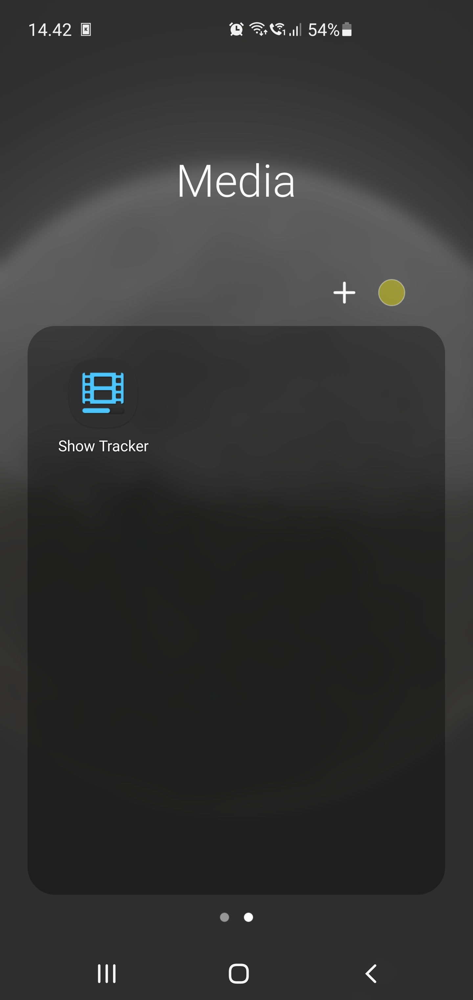
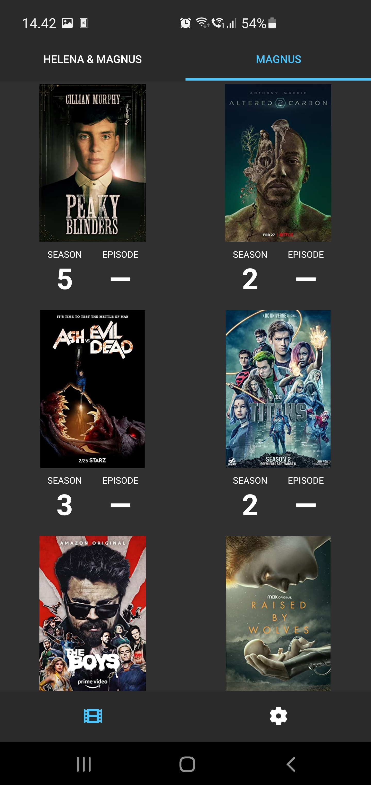
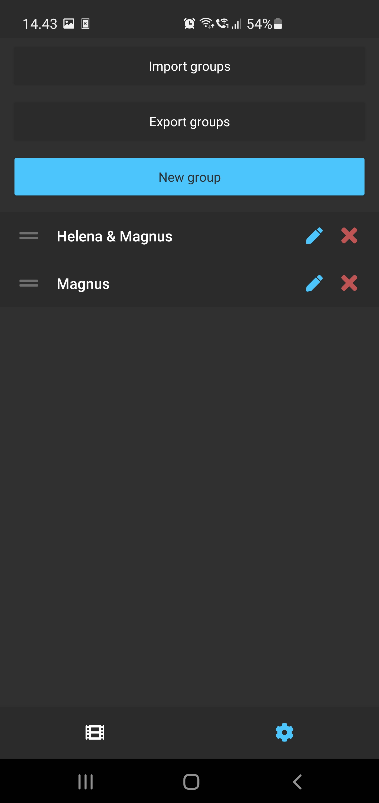

# Show Tracker
An Android app for keeping track of the shows you watch.

## Features
### Groups
The app can keep track of shows being watched by dividing them into distinct groups. For example, a group of shows could be tied to 'Me' or 'The kids' to signify who's watching which shows (and if they do so together) and allow for separate tracking of progress.
Every group will then display a list of shows and their poster. These groups can be **created**, **moved around**, **renamed**, **deleted**, **exported**, and **imported** (incl. the shows) from the tab with the gear icon.

### Shows
Shows can be **added** to a group by tapping the placeholder poster with the text 'ADD SHOW' in the shows tab, and can be **removed** by tapping a show's poster and tapping 'Remove show'.
When adding a new show, you will have to spell out the show's title correctly, but don't worry about capitalization or punctuation.

### Sorting & filtering shows
You can toggle the **favorite** status of a show by tapping the poster and tapping the star icon in the upper right corner - this will display the show at the top of the list of shows.

You can also **search** for a show with the search bar at the top of the shows-list. Don't worry about being all thumbs, in contrast to when *adding* a show, this filtering can handle a few spelling errors.

### Episode tracking
Each show keeps track of the last season and episode that has been watched.
This **progress** can be manipulated either by tapping the show's poster and tapping 'Set progress', or the episode count can be incremented by double tapping a show's poster, and decremented på long-pressing the poster (if you happen to make a mistake).

The app will keep up to date with released episodes and shows, and will thus know when a season ends and a new begins - this means you can just keep double tapping whenever you have watched an episode, and the app will automatically start a new season when needed!

### Miscellaneous information
When the last episode of a season has been watched (either because there are no more episodes until next season, or because the rest of the season has not been released yet), the episode count will display a long dash, letting you know you have reached the end of the season.
If a new episode is released in the same season, the dash should disappear letting you know there is a new episode ready, since now the new episode is the last of the season.

When tapping a show's poster, the app will also show you:
1. The airdate of the next episode, if it is known (this might not be for *your* platform, if the show is released elsewhere before coming to your platform)
2. The runtime of the next episode, if it is known
3. The number of released episodes left to watch

### Disclaimer
Be aware that all of this data comes from OMDB and TVMaze, and therefore I cannot control if there are any errors such as a planned episode (but unreleased) that shows up as a watchable episode (unfortunately, it happens sometimes).

## Tech
- **Framework:** NativeScript Vue
- **Data:** OMDB (primarily) and TVMaze (extra show information)

## Screenshots
### Icon

### Shows page

### Settings page

